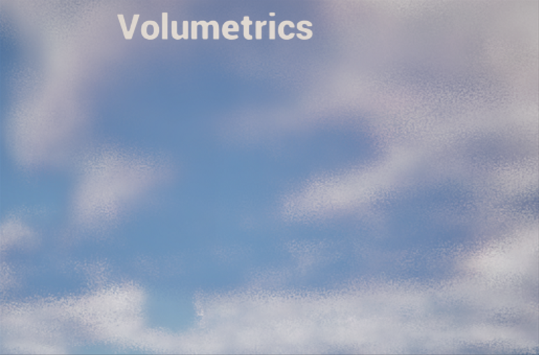
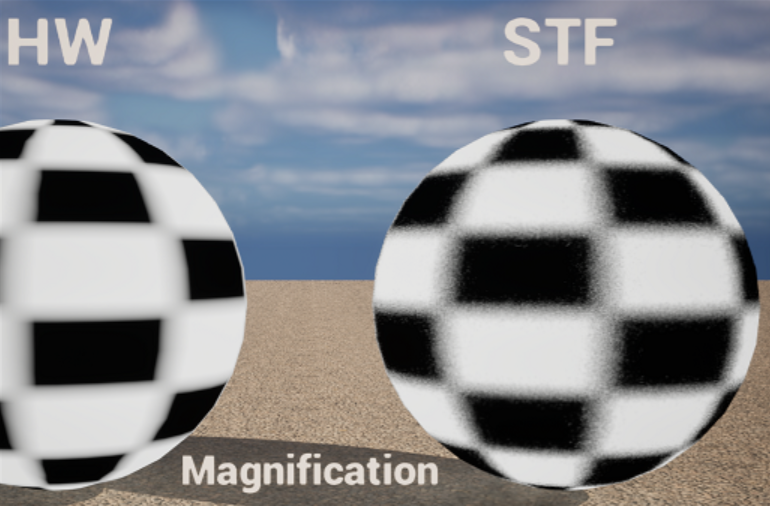

# RTX Texture Filtering (RTXTF)


## Description

RTX Texture Filtering as described in this link https://research.nvidia.com/publication/2024-05_filtering-after-shading-stochastic-texture-filtering is a technique that allows for more flexibility in texture filtering.
RTXTF effectively loads a texel per frame based on the target filter and the probability to select a texel in that filtering footprint.  Over many frames, the texels are interpolated based on frequency of selection in the filtering footprint with a TAA upscaler.
The best results of interpolating with a TAA upscaler have been observed with DLSS-SR for bilinear and for noisier higher order filters like bicubic or gaussian, DLSS-RR is recommended.
Some of the main differences with RTXTF is that shading is performed prior to filtering and higher order filters can be used without adding performance degradation due to the stochastic filtering approach.  

Filter types supported for Texture2D, Texture2DArray, TextureCube, Texture3D:
1) Linear
2) Cubic
3) Gaussian

## Project structure
|Directory                   |Details                                      |
|----------------------------|---------------------------------------------|
|[/docs][docs]               |_Documentation for showcased tech_           |
|[/donut][donut]             |_Framework used for the samples_             |
|[/assets][assets]             |_Assets and scene definitions_               |
|[/sample][sample]           |_Sample showcasing usage of RTXTF-Library    |

## Getting up and running

### Prerequisites
Any DXR GPU **|** [CMake v3.24.3][CMake] **|** [Vulkan SDK 1.3.268.0][VKSDK] **|** [VS 2022][VS22] **|** Windows SDK ≥ 10.0.20348.0 **|** Driver ≥ 555.85

### Further steps
- [Quick start guide][QuickStart] for building and running the RTXTF sample.
- [RTXTF integration guide][RTXTFGuide].
- [RTXTF Visuals][RTXTFVisuals].

## Citation
Use the following BibTex entry to cite the usage of RTXTF in published research:
```bibtex
@online{RTXTF,
   title   = {{{NVIDIA}}\textregistered{} {RTXTF}},
   author  = {{NVIDIA}},
   year    = 2025,
   url     = {https://github.com/NVIDIA-RTX/RTXTF},
   urldate = {2025-02-06},
}
```

## Known Issues

- Be cautious when implementing RTXTF with volumetrics, decals, alpha maps, noise textures or look up tables because they can lead to unexpected results.

- Alpha tested shadows with RTXTF can introduce unwanted noise in the penumbra.
- Using RTXTF with offscreen render targets like Shadow Maps or Cube Maps will not accumulate enough samples to be properly denoised by DLSS.
- We recommend using quad 2x2 wave intrinsics as a method to reduce lighting artifacts if they are present.
- RTXTF requires DLSS to resolve the noise that RTXTF generates.  Any RTXTF methods performed after DLSS will be noisy.
- Making RTXTF optional with regular HW filtering can lead to additional shader permutations having to be added.
- When DLSS-SR is in upscaling mode there can be undesirable noise in the output in some cases.
- DLSS-SR upscaling under extreme magnification will experience noise that may have trouble denoising/converging.


## Support

Please use issues to submit any request for changes or email rtxtf-sdk-support@nvidia.com for developer support.

## License

[NVIDIA RTX SDKs LICENSE](LICENSE.txt)

[docs]: docs
[QuickStart]: docs/QuickStart.md
[RTXTFGuide]: docs/RTXTFGuide.md
[RTXTFVisuals]: docs/RTXTFVisuals.md
[donut]: external/donut
[assets]: assets
[sample]: samples/stf_bindless_rendering
[CMake]: https://cmake.org/download/
[VKSDK]: https://vulkan.lunarg.com/sdk/home#windows
[VS22]: https://visualstudio.microsoft.com/vs/
