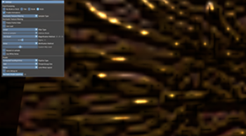
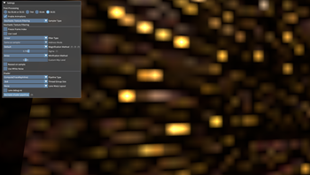
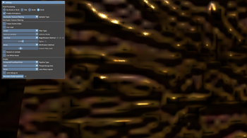
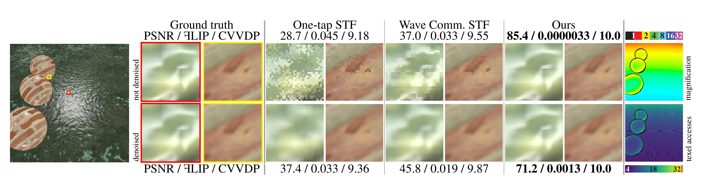

# Quick Start Guide

This document lists the necessary steps to get up and running with the RTXTF sample.


### Build steps

**1.** Clone the project recursively:
    ```
    git clone --progress --recursive --branch main -v "https://github.com/NVIDIA-RTX/RTXTF"
    ```

**2.** Configure and then generate the solution using CMake GUI (or the CLI) by setting the repository root as _source_ and specifying a new _build_ directory in the root.

**3.** Build the solution and run the `Examples/STF Bindless Rendering/stf_bindless_rendering` sample.

### The stf_bindless_rendering sample
The stf_bindless_rendering sample demonstrates a simple ray traced application that traces primary rays and shadow rays from primary surfaces.  RTXTF is applied prior to filtering for primary surface hits.


**1. Post Processing.** Post processing or the filtering component of RTXTF has four options.  Passthrough (No filtering), TAA (Temporal Anti Aliasing), DLAA (Deep Learning Anti Aliasing) and DLSS (Deep Learning Super Sampling).  Each option will provide different filtering capabilities to compare with.

**2. Enable Animations.** Freezes the animation when deselected.

**3. Sampler Type.** Allows the user to choose between Hardware Sampling which bypasses RTXTF, regular RTXTF sampling and split screen mode to compare the two.

**4. RTXTF settings.**
  1. Freeze frame index keeps the same frame number to show a snapshot of RTXTF signal/noise.<br/>
  2. Use Load forces texture loads to occur and when disabled the sampler is used and samples discretely at texels.<br/>
  3. Filter Type can use Linear, Cubic or Gaussian filters.<br/>
    
  4. Address modes include same as sampler, clamp and wrap which are used when texture loads are enabled.<br/>
  5. Magnification methods include default which uses only one sample per frame. Wave lane sharing techniques allow multiple samples in the form of *x* to enable a primitive form of interpolation prior to shading. More samples typically means more samples for DLSS to deal with and can introduce more noise.  That is why we recommend using 2x2 Quad wave lane sharing to reduce the most noise and take advantage of primitive interpolation prior to shading.<br/>
	 Techniques visualized below are respectively: default filtering after shading, 2x2 quad, 2x2 fine, 2x2 fine temporal, 3x3 fine and 4x4 fine methods.<br/>
	 |  | 
	 |  | 
	
  6. Collaborative Texture Filtering has significantly improved magnification.  These new techniques are called MinMaxV1, MinMaxV2 and Mask methods.  The image below illustrates the progression of magnification methods using CTF variants.<br/>
	
  7. Sigma is for the Gaussian filter.<br/>
  8. Minification methods include Aniso, ForceNegInf, ForcePosInf, ForceNan and ForceCustom.<br/>
  9. Custom Mip level is associated with ForceCustom in Minification methods.<br/>
  10. Reseed on sample takes a new RNG value per sample.<br/>
  11. Use White Noise is enabled instead of Spatio Temporal Blue Noise which is the default.<br/>

**5. Shader settings.** Pipeline types include DXR 1.0 and DXR 1.1 methods.  DXR 1.1 uses a compute shader.  Thread group size allows the user to set wave to be certain group sizes.  Lane warp layout changes the swizzling of the shader.  Lane debug viz shows the lane values on screen.  Recreate shader pipelines allow for building shaders on the fly.