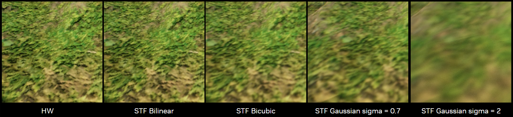
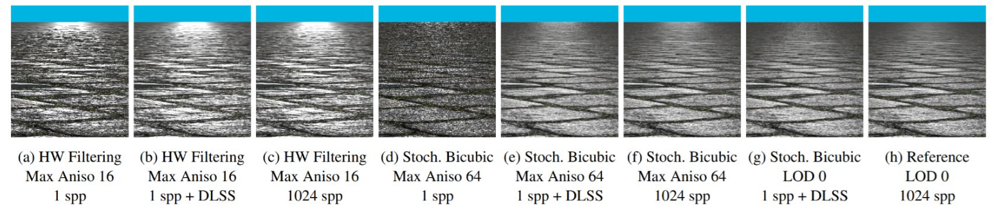

# RTXTF Visuals

## Magnification and Minification

### Filter Comparison under Magnification

### Filter Comparison under Minification with Unlimited Anisotropy

## Filtering Options with DLSS Variants

### DLSS-SR Filtering an RTXTF Bilinear Signal

### DLSS-RR Filtering an RTXTF Gaussian Signal
